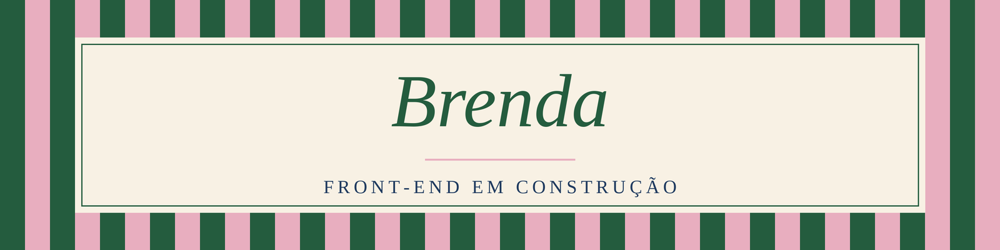

# Oi, eu sou a Brenda

Estudo Engenharia Ambiental na UFF. Foi na faculdade, no primeiro contato
com programação (Python), que percebi o quanto isso abre a cabeça, e daí
veio a vontade de migrar para desenvolvimento front-end e criar
interfaces bonitas.

Faço o curso Fullstack da Rocketseat e estudo **JavaScript**. Angular
é o próximo passo e quero começar a estudar em breve.

Meu objetivo é trabalhar com front-end e chegar cada vez mais perto
da área de design de interfaces.

## Stack

## Contato
[brendarangelbr1@gmail.com](mailto:brendarangelbr1@gmail.com)
